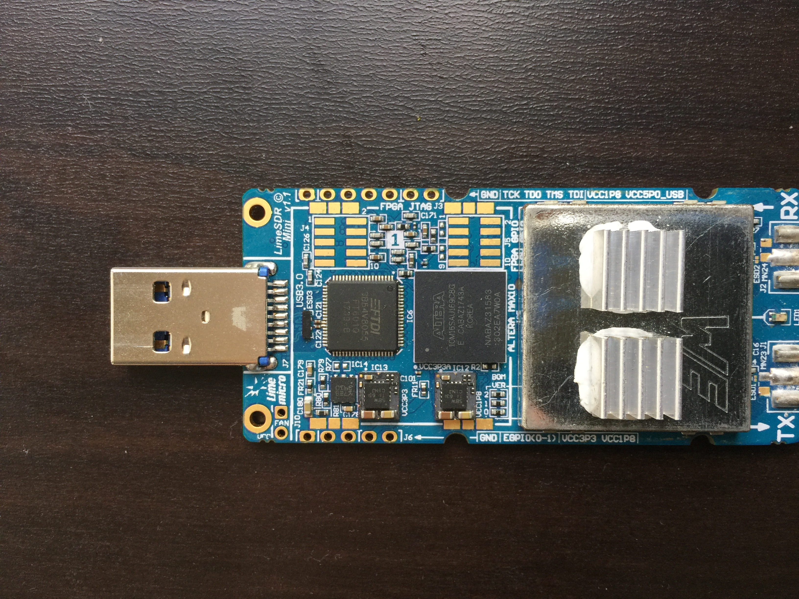

# LimeSDR-Mini FPGA Gateware OpenOCD Programmer

This folder contains configuration files and a Bash Script made to program a LimeSDR-Mini FPGA via JTAG using OpenOCD. 

## Supported Adapters
This script was tested with the following JTAG cables:

- FT2232H
- FT232H
- OLIMEX (Not Tested)

## Required Software
You will need OpenOCD installed. LimeSDR-Mini uses an Altera 10M16 FPGA that is compatible with OpenOCD since the version 0.10.0 released on January 2017. Make sure you are running the latest version of OpenOCD by running the command below in the command line.

´´´ bash
$ openocd -v 
Open On-Chip Debugger 0.10.0
Licensed under GNU GPL v2
For bug reports, read
	http://openocd.org/doc/doxygen/bugs.html
´´´

## Wiring 
This script uses a JTAG connection to program the FPGA gateware. The JTAG header of the LimeSDR-Mini is located on the side of the device according the picture below. You will need to connect your cable respective pins to the GND, TCK, TDO, TMS & TDI. A quick reference for this pins is located on the right of the header.

| Cable   | TCK | TDO | TMS | TDI |
| ------- | --- | --- | --- | --- |
| FT2232H | ADBUS0 | ADBUS2 | ADBUS3 | ADBUS1 |
| FT232H  | ADBUS0 | ADBUS2 | ADBUS3 | ADBUS1 |

## Installation 
Clone this repository into your computer and open it via command line. 

´´´ bash
git clone https://github.com/luigifreitas/LimeSDR-Mini_GW.git
cd LimeSDR-Mini_GW/LimeSDR-Mini_bitstreams/OpenOCD
chmod u+x programmer.sh
´´´

## Usage
After connecting the JTAG header to your adapter and powering the LimeSDR-Mini with a USB Cable, execute the command below in the command line. Remember to change the ADAPTER_NAME to your adapter model listed [here](#Supported-Adapters).

´´´ bash
./programmer.sh ADAPTER_NAME
´´´